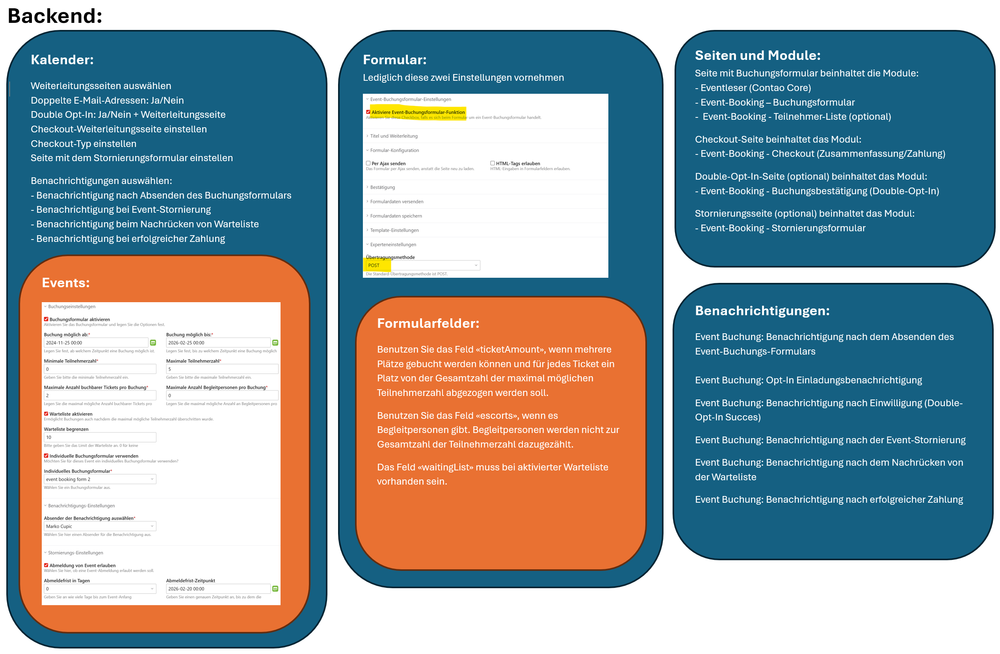

# Events buchen mit Contao

> **Migration von Version 5.x nach 6.x**
>
> Bei der Migration von Version 5.x nach 6.x kam es zu zahlreichen [Änderungen](https://github.com/markocupic/calendar-event-booking-bundle/blob/6.x/UPGRADE.md). Die Event- und Kalendereinstellungen müssen nach der Migration unbedingt überprüft und angepasst werden. Vor dem Upgrade sollte ein Datenbank-Backup erstellt werden.

## Events buchen

Mit dieser Erweiterung für Contao CMS werden Events über ein Anmeldeformular buchbar. Double-Opt-In, eine Warteliste und ein Bezahlcheckout sind möglich.
Das Anmeldeformular kann im Contao Formulargenerator erstellt werden. Während des Installationsprozesses wird ein Sample Anmeldeformular generiert.
Beim Absenden des Formulars werden die Werte in der Datenbank in der Tabelle tl_calendar_events_member abgelegt. Die Buchungen sind im Backend einsehbar und über eine CSV-Datei exportierbar.

## Bezahl-Checkout

Der Bezahl-Checkout ist zahlungspflichtig (Bitte Autor der Extension per E-Mail kontaktieren)

Im Moment sind folgende **Zahlungsmethoden** vorhanden:

- PayPal

## Benachrichtigungen

Event-Organisator und Teilnehmer lassen sich bei jedem Prozess automatisch benachrichtigen (Notification Center).

## Warteliste

Optional kann eine Warteliste aktiviert werden. Personen auf der Warteliste rücken automatisch nach, wenn Plätze durch Stornierung frei werden.
Nachrücken können nur Personen,

- deren Anmeldung nicht storniert wurde.
- deren Anmeldung nicht temporär ist.
- deren Reservierungsanfrage nicht abgelaufen ist.
- Die Warteliste sollte nicht mit einem Bezahlungs-Checkout kombiniert werden.

## Double-Opt-In

Bei den Buchungseinstellungen kann optional eine Bestätigung der Buchungsanfrage aktiviert werden.
Dabei wird mit der Benachrichtigung (Event Buchung: Benachrichtigung nach dem Absenden des Event-Buchungs-Formulars) ein Link versandt.
Dazu muss das Modul "Event Buchung: Buchungsbestätigung (Double-Opt-In)" erstellt werden.
Wenn der Kunde/User seine Buchungsanfrage nicht bestätigt, erlischt nach einer frei konfigurierbaren Zeit seine Anfrage und sein Platz wird für andere frei.
Abschnitt "Konfiguration" beachten!

## Frontend-Module

| Frontend-Modul                                      | Erklärung                                                                                                                                                                                                                                                                                                                                                                                                                                              |
|:----------------------------------------------------|:-------------------------------------------------------------------------------------------------------------------------------------------------------------------------------------------------------------------------------------------------------------------------------------------------------------------------------------------------------------------------------------------------------------------------------------------------------|
| Event-Booking - Buchungsformular                    | Wird benötigt, um das Event-Buchungsformular auszugeben. Das Modul ist auf den Event-Identifier in der URL angewiesen und befindet sich typischerweise auf der selben Seite wie das Event-Leser-Modul.                                                                                                                                                                                                                                                 |
| Event-Booking - Checkout (Zusammenfassung/Zahlung)  | Dieses Modul sollte auf der Weiterleitungsseite eingerichtet werden, auf die Kunden nach dem Absenden des Buchungsformulars weitergeleitet werden. Es zeigt eine kurze Bestätigung und Zusammenfassung der Buchung an oder löst den Zahlungscheckout aus (kostenpflichtig).                                                                                                                                                                            |                                                                                                                                                                                                                                                                                                                                                                                                                                                   |
| Event-Booking - Buchungsbestätigung (Double-Opt-In) | Optional! Dieses Modul muss auf der Seite platziert werden, wohin User weitergeleitet werden, wenn sie den Buchungsbestätigungslink angeklickt haben, welcher mit der Benachrichtigung (Event Buchung: Benachrichtigung nach dem Absenden des Event-Buchungs-Formulars) versandt worden ist. Die Seite muss in den Kalendereinstellungen konfiguriert werden. Dieses Modul sollte nicht in Kombination mit einem Bezahlungs-Checkout verwendet werden. |
| Event-Booking - Stornierungsformular                | Optional! Dieses Modul muss auf der Seite platziert werden, wohin User weitergeleitet werden, wenn sie den Buchungs-Stornierungslink angeklickt haben, welcher mit der Benachrichtigung (Event Buchung: Benachrichtigung nach dem Absenden des Event-Buchungs-Formulars) versandt worden ist. Die Seite muss in den Kalendereinstellungen konfiguriert werden.                                                                                         |
| Event-Booking - Teilnehmer-Liste                    | Optional! Dieses Modul listet die vorhandenen Buchungen auf. Das Modul ist auf den Event-Identifier in der URL angewiesen und befindet sich typischerweise auf der selben Seite wie das Event-Leser-Modul.                                                                                                                                                                                                                                             |
| Event-Booking - Meine Buchungen                     | Zeigt alle Buchungen des aktuell eingeloggten Users an. Funktioniert nur, wenn der User zum Zeitpunkt der Event-Buchung eingeloggt war. Zu diesem Zweck sollte das Anmeldeformular nur angemeldeten FE-Usern zugänglich gemacht werden.                                                                                                                                                                                                                |

## Einrichtung (Ablauf)



### 1. Kalender und Events anlegen.

Auf Kalenderebene muss/müssen unter anderem
- die Seite mit dem Event-Buchungs-Checkout-Modul ausgewählt werden.
- die Seite mit dem Event-Buchungs-Stornierungs-Modul ausgewählt werden.
- alle Benachrichtigungen ausgewählt werden
- der Checkout-Typ gewählt werden. (PayPal ist zahlungspflichtig)

Danach sollten die Events angelegt werden und die Buchungsoptionen konfiguriert werden.

### 2. Buchungsformular erstellen und erweitern

Beim Aufrufen der Datenbankmigration wird **automatisch** ein Beispielformular mit allen benötigten Feldern generiert.

#### Einstellungen im Formular

- **Im Formular muss die Checkbox "Aktiviere Event-Buchungsformular-Funktion" aktiviert sein!**
- **Im Formular sollte keine Weiterleitungsseite eingetragen werden! Die Weiterleitungsseitte sollte stattdessen in der Kalendereinstellung ausgewählt werden (Seite mit dem Checkout-Modul).**
- **Es sollte keine Benachrichtigung ausgewählt werden. Diese wird in der Kalendereinstellung ausgewählt.**
- **Übertragungsmethode: POST**

#### Formularfelder und Datenbankfelder

- Das Formularfeld `bookingUuid` wird automatisch generiert.
- Folgende Felder werden im Beispielformular mitgeliefert und deren Inhalt beim Absenden des Formulars wird in der Datenbank (tl_calendar_events_member) gespeichert:
  `waitingList`, `gender`, `firstname`, `lastname`, `dateOfBirth`, `street`, `postal`, `city`, `phone`, `email`, `ticketAmount`, `escorts`, `notes`
- Benutzen Sie das Feld `ticketAmount`, wenn mehrere Plätze gebucht werden können und für jedes Ticket ein Platz von der Gesamtzahl der maximal möglichen Teilnehmerzahl abgezogen werden soll.
- Benutzen Sie das Feld `escorts`, wenn es Begleitpersonen gibt. Begleitpersonen werden **nicht** zur Gesamtzahl der Teilnehmerzahl dazugezählt.
- Das Feld `waitingList` muss bei aktivierter Warteliste vorhanden sein.
- Es können zusätzliche Felder im Formulargenerator erstellt werden. Damit die Daten in der Datenbank gespeichert werden, muss die DCA im Projekt-ROOT unter `contao/dca/tl_calendar_events_member.php` erweitert werden. Danach muss via Shell der Cache neu aufgebaut `composer install` und die
  Datenbankmigration ausgeführt werden. `vendor/bin/contao-console contao:migrate`

```php
<?php
// Put this in TL_ROOT/contao/dca/tl_calendar_events_member.php

use Contao\CoreBundle\DataContainer\PaletteManipulator;

// Add an additional field to tl_calendar_events_member
$GLOBALS['TL_DCA']['tl_calendar_events_member']['fields']['foodHabilities'] = [
    'exclude'   => true,
    'search'    => true,
    'sorting'   => true,
    'inputType' => 'select',
    'options'   => ['vegetarian', 'vegan'],
    'eval'      => ['includeBlankOption' => true, 'tl_class' => 'w50'],
    'sql'       => ['type' => 'string', 'length' => 255, 'notnull' => true],
];

// Add a new legend and custom field to the default.
PaletteManipulator::create()
    ->addLegend('food_legend', 'personal_legend', PaletteManipulator::POSITION_AFTER)
    ->addField(['foodHabilities'], 'food_legend', PaletteManipulator::POSITION_APPEND)
    ->applyToPalette('default', 'tl_calendar_events_member');
```

### 3. Frontend Module anlegen

### 4. Seiten und Artikel anlegen

So könnte ein funktionierender Seitenaufbau mit den zugehörenden Modulen aussehen:

| **Seite**       | **Event Buchung**                                                                                                      | **Checkout**             | **Opt-In** (optional)                | **Stornierung** (optional)           | **Meine Buchungen** (optional)                                                                                                             |
|:----------------|:-----------------------------------------------------------------------------------------------------------------------|:-------------------------|:-------------------------------------|:-------------------------------------|--------------------------------------------------------------------------------------------------------------------------------------------|
| **Module**      | Event-Booking - Buchungsformular<br>Event-Booking - Teilnehmer-Liste                                                   | Event-Booking - Checkout | Event-Booking - Buchungs-Bestätigung | Event-Booking - Stornierungsformular | Event-Booking - Meine Buchungen                                                                                                            |
| **Zu beachten** | Beide Module benötigen den Event-Alias in der URL und sollten deshalb idealerweise auf einer Event Detailseite liegen. |                          | optional                             | optional                             | optional<br>Zeigt die Buchungen des eingeloggten Users an. Funktioniert nur, wenn der User zum Zeitpunkt der Registrierung angemeldet war. |

- Seite und Artikel mit dem Modul **Buchungsformular** anlegen. Das Modul **Buchungsformular** ist auf den Event-Alias in der URL angewiesen und sollte idealerweise auf einer Event-Detail-Seite angelegt werden.

- Seite und Artikel mit dem Modul **Event-Buchungs-Checkout** einrichten.

### 5. Benachrichtigungen mit Notification Center anlegen

| Benachrichtigungen (Notification Center)                                       |
|:-------------------------------------------------------------------------------|
| Event Buchung: Benachrichtigung nach dem Absenden des Event-Buchungs-Formulars |
| Event Buchung: Opt-In Einladungsbenachrichtigung                               |
| Event Buchung: Benachrichtigung nach Einwilligung (Double-Opt-In Succes)       |
| Event Buchung: Benachrichtigung nach der Event-Stornierung                     |
| Event Buchung: Benachrichtigung nach dem Nachrücken von der Warteliste         |
| Event Buchung: Benachrichtigung nach erfolgreicher Zahlung                     |

Versenden Sie zu verschiedenen Zeitpunkten Benachrichtigungen und nutzen Sie dabei die **Simple Tokens**.

Mit `##member_unsubscribeLink##` kann ein tokengesicherter Event-Stornierungs-Link mitgesandt werden.
Dazu muss aber im Event die Event-Stornierung aktiviert werden und im Kalender die Seite mit dem Modul **Event-Stornierungsformular** eingerichtet worden sein.

#### Gebrauch der Simple Tokens im Notification Center

|                                           |                              |                                                                                                                                                                                                                                                           |
|:------------------------------------------|:-----------------------------|:----------------------------------------------------------------------------------------------------------------------------------------------------------------------------------------------------------------------------------------------------------|
| Teilnehmer                                | `tl_calendar_events_member`  | `##member_gender##` (Männlich, Weiblich oder Divers), `##member_salutation##` (Übersetzt: Herr oder Frau), `##member_email##`, `##member_firstname##`, `##member_street##`, etc.                                                                          |
| Event                                     | `tl_calendar_events`         | `##event_title##`, `##event_street##`, `##event_postal##`, `##event_city##`, `##event_unsubscribeLimitTstamp##`, etc.                                                                                                                                     |
| Organisator/Email-Absender                | `tl_user`                    | `##organizer_name##`, `##organizer_email##`, etc.                                                                                                                                                                                                         |
| Angaben zur Zahlung                       | `tl_calendar_events_payment` | `##uuid##`, `##bookingUuid##`, `##paidAt##`, `##refundedAt##`, `##method##`, `##transactionId##`, `##transactionStatus##`, `##currencyCode##`, `##taxValue##`, `##grossAmount##`, `##netAmount##`, `##vatAmount##`, `##transactionDetails##`, `##notes##` |
| Insert-Tags und Simple Tokens kombinieren | `format_date`, usw.          | Simple Tokens lassen sich mit Insert-Tags kombinieren. -> `{{format_date::##member_dateOfBirth##::d.m.Y}}`, `{{format_date::##event_startDate##::d.m.Y}}`, usw.                                                                                           |

#### Benachrichtigung (Beispiel: Benachrichtigung nach erfolgreicher Zahlung)

```
{if member_gender=='male'}
Sehr geehrter Herr ##member_firstname ##` ##member_lastname##
{elseif member_gender=='female'}
Sehr geehrte Frau ##member_firstname## ##member_lastname##
{else}
Hallo ##member_firstname## ##member_lastname##
{endif}

Hiermit bestätigen wir den Eingang Ihrer Buchungsanfrage zur Veranstaltung "##event_title##" vom {{format_date::##event_startDate##::d.m.Y}}.

Ihre Angaben:
Name/Vorname: ##member_firstname## ##member_lastname##
Adresse: ##member_street##, ##member_postal##, ##member_city##
Telefon: ##member_phone##
E-Mail: ##member_email##
Begleitpersonen: ##member_escorts##
Anzahl Tickets: ##member_ticketAmount##
Geschlecht: ##member_gender##
Geburtsdatum: {{format_date::##member_dateOfBirth##::d.m.Y}}

Stornierung erlauben: {if event_enableDeregistration=='1'}Ja{else}Nein{endif}

{if payment_method!=''}
Ihre Bezahlung:
Bezahldienstleister: ##payment_method##
Total: ##payment_grossAmount## ##payment_currencyCode##
{endif}

{if member_waitingList=='1'}
Auf Warteliste: JA!
{endif}

{if calendar_requireOptIn=='1'}
Bitte beachten Sie, dass Ihre Buchung erst nach Bestätigung mit dem Bestätigungslink gültig wird.
##member_optInLink##
{endif}

{if event_enableDeregistration=='1'}
Bitte benutzen Sie folgenden Link, um sich wieder von der Veranstaltung abzumelden:
##member_unsubscribeLink##
Achtung! es können nur Stornierungen bis zum {{format_date::##event_unsubscribeLimitTstamp##::d.m.}} angenommen werden.
{endif}

Freundliche Grüsse

##organizer_name##
```

### 6. In den Kalendereinstellungen alle Weiterleitungsseiten einrichten.

### 7. In den Kalendereinstellungen alle gewünschten Benachrichtigungen auswählen.

### 8. In den Kalendereinstellungen weitere Einstellungen vornehmen.

### 9. Bundle-Konfiguration anpassen `config/config.yaml`

Weitere Einstellungen lassen sich über die Bundle-Konfiguration vornehmen in der Datei `config/config.yaml`.
Falls nicht vorhanden, muss diese zuerst erstellt werden.

```yaml
# config/config.yaml
markocupic_calendar_event_booking:
  auto_expire_reserved_bookings: true
  auto_expire_time_limit: 3600
  auto_delete_expired_bookings: false
  auto_delete_canceled_bookings: false
  auto_waiting_list_promotion: true
  notification:
    log:
      exclude: [ html,text ] # Um Platz in der Datenbank zu sparen, den Text der Nachrichten in tl_calendar_events_booking_notification nicht abspeichern
  rate_limiter:
    event_booking_form: # Gebrauch des Buchungsformulars begrenzen
      enable: true
      policy: 'fixed_window'
      limit: 5
      interval: '15 minutes'
  member_list_export:
    enable_output_conversion: false
    convert_from: 'UTF-8'
    convert_to: 'ISO-8859-1'
```

| **Paramter**                                  | **Default**    | **Erklärung**                                                                                                                                                                       |
|:----------------------------------------------|:---------------|:------------------------------------------------------------------------------------------------------------------------------------------------------------------------------------|
| `auto_expire_reserved_bookings`               | `true`         | Unbestätigte Anmeldungen/Anmeldungen oder Anmeldungen mit nicht erledigten Zahlungen werden nach Ablauf einer konfigurierbaren Zeit (auto_expire_time_limit) automatisch abgelehnt. |
| `auto_expire_time_limit`                      | `3600`         | Zeit in Sekunden, welche dem User ab dem Moment der Registrierung bleibt, um seine Buchung per Link zu bestätigen oder um die Zahlung zu erledigen.                                 |
| `auto_delete_expired_bookings`                | `false`        | Abgelehnte Anmeldungen werden automatisch aus der Datenbank gelöscht. Ein/Aus                                                                                                       |
| `auto_delete_canceled_bookings`               | `false`        | Stornierte Anmeldungen werden automatisch aus der Datenbank gelöscht. Ein/Aus.                                                                                                      |
| `auto_waiting_list_promotion`                 | `true`         | Schaltet das automatische Nachrücken von der Warteliste ein/aus.                                                                                                                    |
| `notification.log.exclude`                    | `[]`           | Hier können Sie einstellen, welche Felder `tl_calendar_events_booking_notification` vom Logging ausgeschlossen sein sollen.                                                         |
| `rate_limiter.event_booking_form.enable`      | `true`         | Form-Submits mit Symfony Rate Limiter begrenzen. Ein/Aus.                                                                                                                           |
| `rate_limiter.event_booking_form.policy`      | `fixed_window` | Rate Limit Methode                                                                                                                                                                  |
| `rate_limiter.event_booking_form.limit`       | `5`            | Rate Limit                                                                                                                                                                          |
| `rate_limiter.event_booking_form.interval`    | `15 minutes`   | Zeit-Intervall                                                                                                                                                                      |
| `member_list_export.enable_output_conversion` | `false`        | Zeichensatz-Konvertierung beim Member-Export ein-/ausschalten.                                                                                                                      |
| `member_list_export.convert_from`             | `UTF-8`        | Quellzeichensatz                                                                                                                                                                    |
| `member_list_export.convert_to`               | `ISO-8859-1`   | Zielzeichensatz                                                                                                                                                                     |

## Template Variablen

Folgende zusätzliche Template Variablen sind in allen Kalender-Templates einsetzbar:

| Tag               | Type   | Erklärung                                                                                                                                  |
|:------------------|:-------|:-------------------------------------------------------------------------------------------------------------------------------------------|
| `event`           | object | `\Contao\CalendarEvntsModel $event` Objekt mit allen Angaben zum Event. Z.B. gibt `event.title` den Event-Namen aus.                       |
| `calendar`        | object | `\Contao\CalendarModel $calendar` Objekt mit allen Angaben zum übergeordneten Kalender. Z.B. gibt `calendar.title` den Kalender-Namen aus. |
| `eventStatus`     | string | `draft`, `booking_open`, `fully_booked`, `waiting_list_open`, `not_bookable`, `not_yet_bookable`, `booking_closed`                         |
| `canRegister`     | bool   | Zeigt, ob eine Buchung (auf Warteliste) möglich ist.                                                                                       |
| `isFullyBooked`   | bool   | Zeigt, ob der Event ausgebucht ist.                                                                                                        |
| `bookingCount`    | int    | Zeigt, die Anzahl Buchungen an.                                                                                                            |
| `freeSpotsCount`  | int    | Zeigt die Anzahl freier Plätze an.                                                                                                         |
| `waitingListOpen` | bool   | Zeigt an, ob die Warteliste geöffnet ist.                                                                                                  |
| `hasLoggedInUser` | bool   | Zeigt an, ob ein Mitglied angemeldet ist.                                                                                                  |
| `loggedInUser`    | null   | FrontendUser Gibt null oder das FrontendUser Objekt zurück.                                                                                |

## Event Teilnehmer als CSV-Datei herunterladen (Encoding richtig einstellen)

Die Teilnehmer eines Events lassen sich im Backend als CSV-Datei (Excel) exportieren.
In der `config/config.yaml` lässt sich das Encoding einstellen.
Standardmässig werden die Daten im Format **UTF-8** exportiert.
Es kann sein, dass Excel (bei entsprechender Einstellung), dann Umlaute falsch darstellt.
Das Problem kann behoben werden, wenn die `config/config.yaml` dahingehend anpasst wird,
dass die Inhalte vor dem Export von **UTF-8** nach **ISO-8859-1** konvertiert werden.

```
markocupic_calendar_event_booking:
  member_list_export:
    enable_output_conversion: true
    convert_from: 'UTF-8'
    convert_to: 'ISO-8859-1'
```

## Frontend-Module-Templates updatesicher anpassen

Die Standard Templates für die Frontend-Module befinden sich unter `vendor/markocupic/calendar-event-booking-bundle/contao/templates/twig/frontend_module`.

Um das Original-Template updatesicher zu überschreiben, muss das abgeänderte Template unter `contao/templates/twig/frontend_module/**module-name**/` abgelegt werden.
Nicht vergessen die obligatorische dot-file `.twig-root` in `contao/templates/twig` anzulegen!
Wenn z.B. das Checkout Template angepasst werden soll, kann das neue Template updatesicher unter `contao/templates/twig/frontend_module/event_booking_checkout/custom.html.twig` abgelegt werden.
Nicht vergessen den Installer einmal durchlaufen zu lassen! `php composer install`
